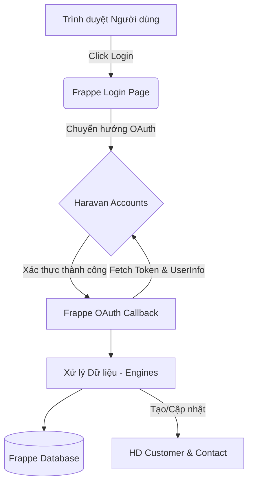

# 🏗️ Kiến trúc Hệ thống

:::info Tóm tắt
Ứng dụng tuân thủ nghiêm ngặt mô hình kiến trúc **7-Layer của Frappe**. Việc tích hợp không thay đổi core của Frappe hay Helpdesk.
:::

## 1. Sơ đồ Kiến trúc

## 2. Các Lớp Kiến trúc (7-Layer Frappe)

### 2.1. Doctype Schema (`login_with_haravan/doctype/`)
Chứa định nghĩa cho các DocType tùy chỉnh, ví dụ như `Haravan Account Link` để ánh xạ giữa user Frappe và tổ chức Haravan.

### 2.2. Business Logic (`login_with_haravan/engines/`)
Đây là nơi chứa toàn bộ logic xử lý:
- `oauth_payload.py`: Giải mã JWT payload.
- `oauth_state.py`: Quản lý state chống CSRF.
- `haravan_api.py`: Gọi API của Haravan để lấy token và thông tin.
- `sync_helpdesk.py`: Đồng bộ profile, tạo `HD Customer` và `Contact`.

### 2.3. Controller & API (`login_with_haravan/oauth.py`)
Endpoint chính: `/api/method/login_with_haravan.oauth.login_via_haravan`.
Nhận request từ Haravan, điều phối logic engine và đăng nhập user.

### 2.4. Setup & Install (`login_with_haravan/setup/install.py`)
Tự động cấu hình các Custom Fields (ví dụ: `custom_haravan_orgid` trên `HD Customer`) trong quá trình cài đặt app.
