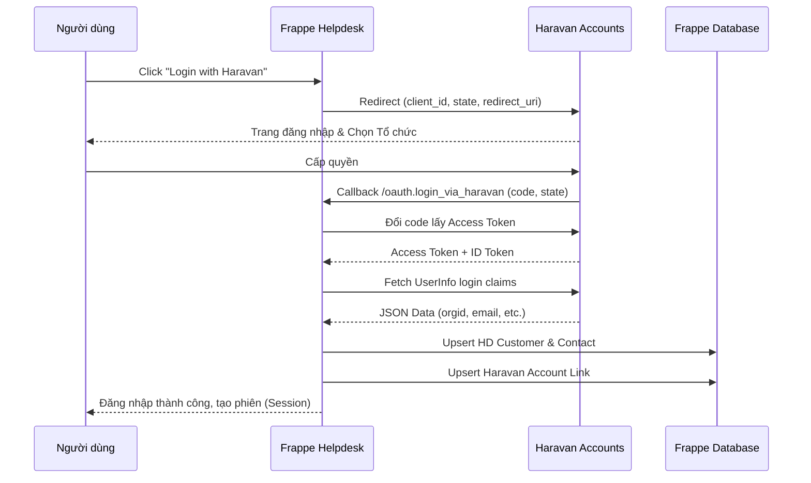

# 🔄 Luồng Dữ liệu (Data Flow)

:::info Tóm tắt
Tài liệu mô tả luồng luân chuyển dữ liệu từ khi người dùng bấm đăng nhập cho đến khi dữ liệu được đồng bộ vào Frappe Helpdesk.
:::

## 1. Luồng OAuth 2.0 & Đồng bộ

## 2. Đồng bộ Khách hàng (Sync Logic)
Logic chính nằm ở `login_with_haravan/engines/sync_helpdesk.py`:
1. **Tìm kiếm HD Customer:** Ưu tiên tìm theo `custom_haravan_orgid`. Nếu không có, tìm theo tên `[OrgID] - [OrgName]`.
2. **Tạo/Cập nhật:** Chỉ cập nhật dữ liệu định danh tối thiểu như `domain`, `custom_haravan_orgid`, `custom_myharavan`.
3. **Customer Profile:** Dữ liệu hồ sơ chi tiết được lấy từ Bitrix khi agent mở hoặc refresh panel Customer Profile.
4. **Phân quyền Contact (Role-based Linking):**
   - **Owner / Admin:** Được tự động tạo `Contact` và liên kết (link) với `HD Customer`. Nhờ đó, họ có thể **xem toàn bộ ticket** của tổ chức.
   - **Staff:** Tạo `Contact` nhưng **KHÔNG** liên kết với `HD Customer`. Nhân viên chỉ có thể **xem các ticket do chính họ tạo ra**.
