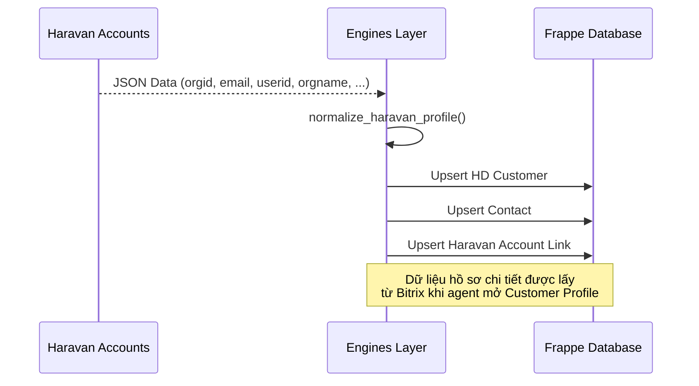
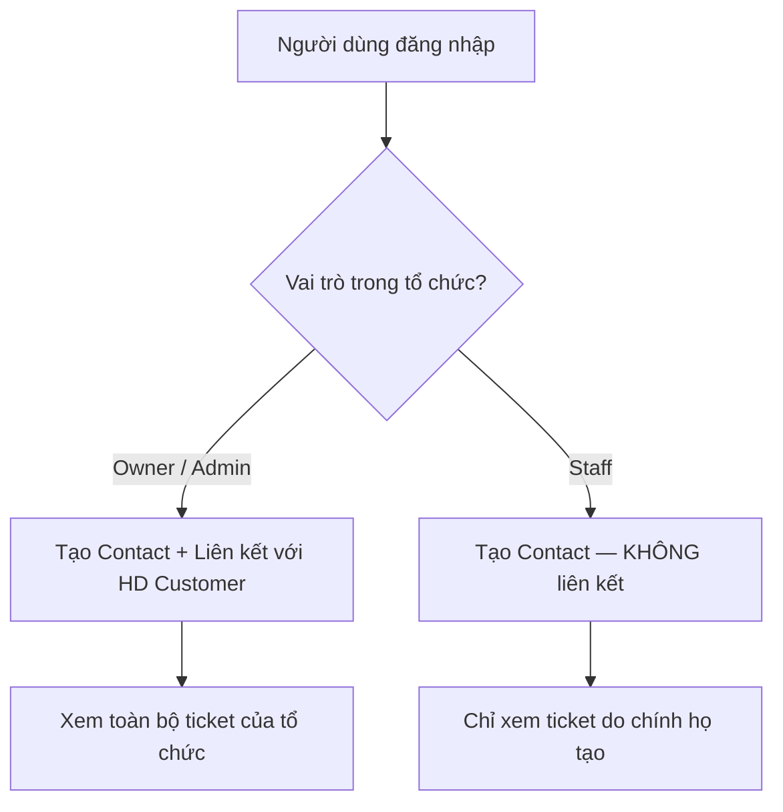

# 🔄 Luồng dữ liệu & Đồng bộ

:::info Tóm tắt
Tài liệu mô tả cách dữ liệu luân chuyển từ khi callback OAuth nhận response, qua quá trình chuẩn hóa, đến khi được lưu vào Frappe Helpdesk.
:::

## 1. Tổng quan luồng dữ liệu

## 2. Logic đồng bộ khách hàng

Logic chính nằm ở `login_with_haravan/engines/sync_helpdesk.py`:

### 2.1. Tìm kiếm HD Customer

| Thứ tự | Phương thức | Mô tả |
|--------|-------------|-------|
| 1 | Tìm theo `custom_haravan_orgid` | Ưu tiên cao nhất — định danh duy nhất tổ chức |
| 2 | Tìm theo tên `[OrgID] - [OrgName]` | Dự phòng nếu custom field chưa được migrate |

### 2.2. Tạo/Cập nhật dữ liệu

Chỉ cập nhật dữ liệu định danh tối thiểu:

| Trường | Nguồn | Mô tả |
|--------|-------|-------|
| `customer_name` | OAuth claim | Tên hiển thị: `[OrgID] - [OrgName]` |
| `domain` | OAuth claim | Tên miền phụ (subdomain) |
| `custom_haravan_orgid` | OAuth claim | ID tổ chức — khóa định danh duy nhất |
| `custom_myharavan` | OAuth claim | Subdomain `.myharavan.com` |

### 2.3. Hồ sơ khách hàng chi tiết

Dữ liệu hồ sơ chi tiết (Bitrix) **không** được lấy trong callback đăng nhập. Thay vào đó, agent Helpdesk kích hoạt việc lấy dữ liệu khi mở hoặc refresh panel Customer Profile.

Xem API chi tiết: [Hồ sơ khách hàng](/api/customer-profile).

## 3. Phân quyền Contact theo vai trò

Hệ thống phân quyền dựa trên vai trò của người dùng trong tổ chức Haravan:

| Vai trò | Tạo Contact | Liên kết HD Customer | Phạm vi xem ticket |
|---------|:-----------:|:-------------------:|:------------------:|
| **Owner / Admin** | ✅ | ✅ | Toàn bộ ticket tổ chức |
| **Staff** | ✅ | ❌ | Chỉ ticket của bản thân |
