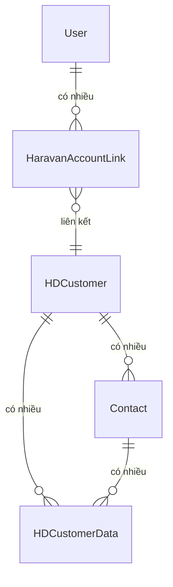

# 🗄️ Cơ sở dữ liệu

:::info Tóm tắt
Dữ liệu của Login With Haravan chủ yếu mở rộng từ các DocType có sẵn của Frappe/Helpdesk, cộng thêm hai DocType tuỳ chỉnh: `Haravan Account Link` và `HD Customer Data`.
:::

## 1. Haravan Account Link (DocType tuỳ chỉnh)

Lưu thông tin liên kết giữa user Frappe và tổ chức Haravan. Mỗi lần đăng nhập, hệ thống upsert bản ghi này.

| Trường | Kiểu | Mô tả |
|--------|------|-------|
| `user` | Link → User | User ID trong Frappe |
| `haravan_userid` | Data | ID người dùng trên Haravan |
| `haravan_orgid` | Data | ID tổ chức trên Haravan |
| `haravan_orgname` | Data | Tên tổ chức |
| `hd_customer` | Link → HD Customer | Khách hàng tương ứng trên Helpdesk |

## 2. HD Customer (DocType mở rộng)

Ứng dụng thêm các **Custom Fields** vào `HD Customer` thông qua hook `after_migrate`:

### Nhóm Haravan

| Trường | Kiểu | Mô tả |
|--------|------|-------|
| `custom_haravan_orgid` | Int | Định danh duy nhất tổ chức — tránh trùng lặp |
| `custom_myharavan` | Data | Tên miền phụ (subdomain) `.myharavan.com` |

### Nhóm Bitrix

| Trường | Kiểu | Mô tả |
|--------|------|-------|
| `custom_bitrix_company_id` | Data | ID công ty trong Bitrix |
| `custom_bitrix_company_url` | Data | Liên kết mở công ty trong Bitrix |
| `custom_bitrix_match_confidence` | Percent | Độ tin cậy khi liên kết dữ liệu |
| `custom_bitrix_sync_status` | Data | Trạng thái đồng bộ hồ sơ |
| `custom_bitrix_last_synced_at` | Datetime | Lần lấy dữ liệu Bitrix gần nhất |

## 3. Contact (DocType tự động tạo)

Khi người dùng đăng nhập, hệ thống tự động tạo hoặc cập nhật Contact:

| Trường | Mô tả |
|--------|-------|
| `email_id` | Email từ Haravan |
| `links` | Liên kết với `HD Customer` qua child table (chỉ cho Owner/Admin) |
| `custom_bitrix_contact_id` | ID contact Bitrix (nếu match được) |
| `custom_bitrix_contact_url` | Liên kết mở contact trong Bitrix |
| `custom_bitrix_last_synced_at` | Lần đồng bộ Bitrix gần nhất |

## 4. HD Customer Data (DocType tuỳ chỉnh)

Lưu snapshot dữ liệu lấy theo nhu cầu từ Bitrix — phục vụ panel Customer Profile của agent.

| Trường | Kiểu | Mô tả |
|--------|------|-------|
| `hd_customer` | Link → HD Customer | Khách hàng liên quan |
| `contact` | Link → Contact | Contact liên quan |
| `source` | Data | Nguồn dữ liệu (VD: `bitrix`) |
| `entity_type` | Data | Loại thực thể: `company` hoặc `contact` |
| `external_id` | Data | ID trên hệ thống nguồn |
| `external_url` | Data | Liên kết đến hệ thống nguồn |
| `summary_json` | Long Text | Dữ liệu tóm tắt đã chuẩn hóa (JSON) |
| `match_key` | Data | Khóa dùng để match |
| `confidence` | Percent | Độ tin cậy match |
| `last_synced_at` | Datetime | Thời điểm đồng bộ gần nhất |

## 5. Sơ đồ quan hệ

