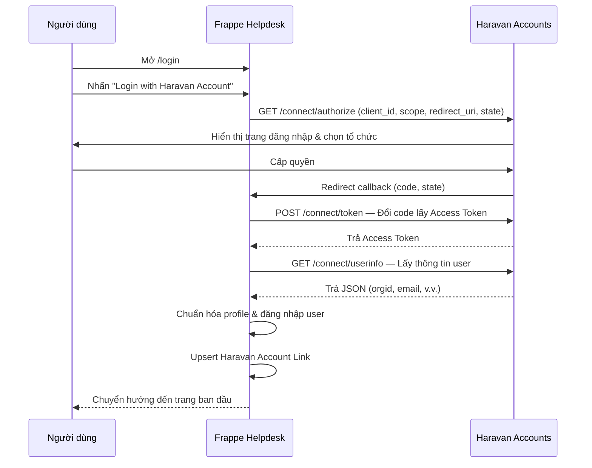
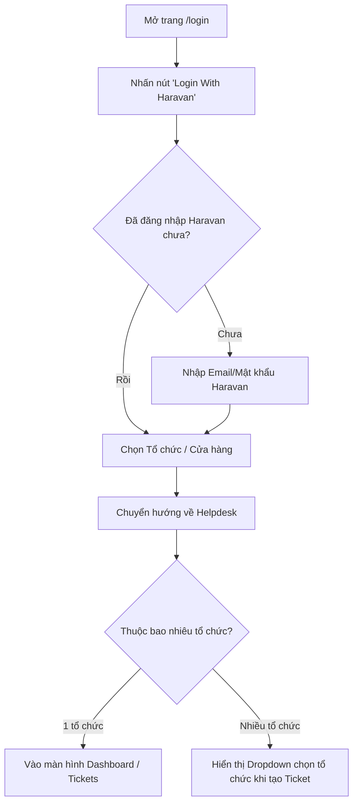

# 🔐 Luồng OAuth & Đăng nhập

:::info Tóm tắt
Tài liệu mô tả chi tiết luồng OAuth 2.0 từ khi người dùng nhấn nút đăng nhập đến khi có phiên làm việc trên Frappe Helpdesk, bao gồm cả trải nghiệm người dùng (UX).
:::

## 1. Sequence Diagram — Luồng kỹ thuật



## 2. Luồng trải nghiệm người dùng (UX)



## 3. Redirect URI

Redirect URI mà Frappe gửi cho Haravan phải khớp **chính xác** với giá trị trên Haravan Partner Dashboard:

```text
https://haravan.help/api/method/login_with_haravan.oauth.login_via_haravan
```

Mặc định, `Social Login Key.redirect_url` được giữ dạng path tương đối — Frappe tự xây dựng URL đầy đủ từ domain của request hiện tại. Nếu cần cố định domain, cấu hình `haravan_account_login.redirect_uri` trong Site Config (xem [Bắt đầu & Cấu hình](/guide/getting-started)).

Nếu Haravan trả lỗi `Invalid redirect_uri`, nghĩa là callback code **chưa được gọi** — vấn đề nằm ở cấu hình, không phải ở code.

## 4. Scope

Chỉ sử dụng scope đăng nhập:

```text
openid profile email org userinfo
```

**Không dùng** commerce scope cho tích hợp login-only này. Nếu cần dữ liệu bán hàng, xem [Lộ trình Pha 1](/about/handoff-roadmap#pha-1-tich-hop-du-lieu-ban-hang-omnichannel-sync).

## 5. Xử lý chuyển hướng sau đăng nhập

Script `haravan_login_redirect.js` đảm bảo người dùng quay lại đúng trang trước đó:

1. Khi vào `/login?redirect-to=/helpdesk/my-tickets/new`, script lưu `redirect-to` vào cookie.
2. Cookie được ghi đè vào `state.redirect_to` trước khi chuyển sang Haravan.
3. Sau khi callback thành công, Frappe đọc cookie và chuyển hướng về `/helpdesk/my-tickets/new`.
4. Nếu không tìm thấy đường dẫn hợp lệ, dự phòng chuyển về `/helpdesk/my-tickets`.
