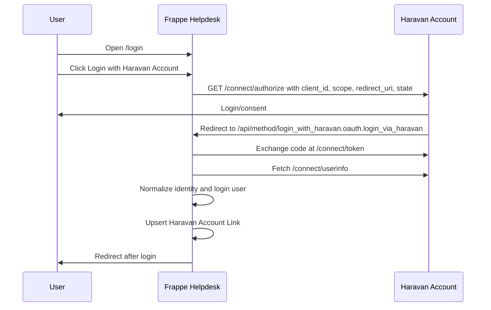

# OAuth Flow

## Sequence



## Redirect URI

The redirect URI generated by Frappe must exactly match the Haravan Partner Dashboard value:

```text
https://haravan.help/api/method/login_with_haravan.oauth.login_via_haravan
```

Default behavior is automatic: `Social Login Key.redirect_url` stays relative,
and Frappe builds the full callback from the active request domain. For a fixed
domain override, set `haravan_account_login.redirect_uri` in Site Config; Frappe
core reads that value at runtime, so no migration is needed.

If Haravan returns `Invalid redirect_uri`, the callback code has not run yet.

## Scopes

Use only login scopes:

```text
openid profile email org userinfo
```

Avoid commerce scopes for this login-only integration.
