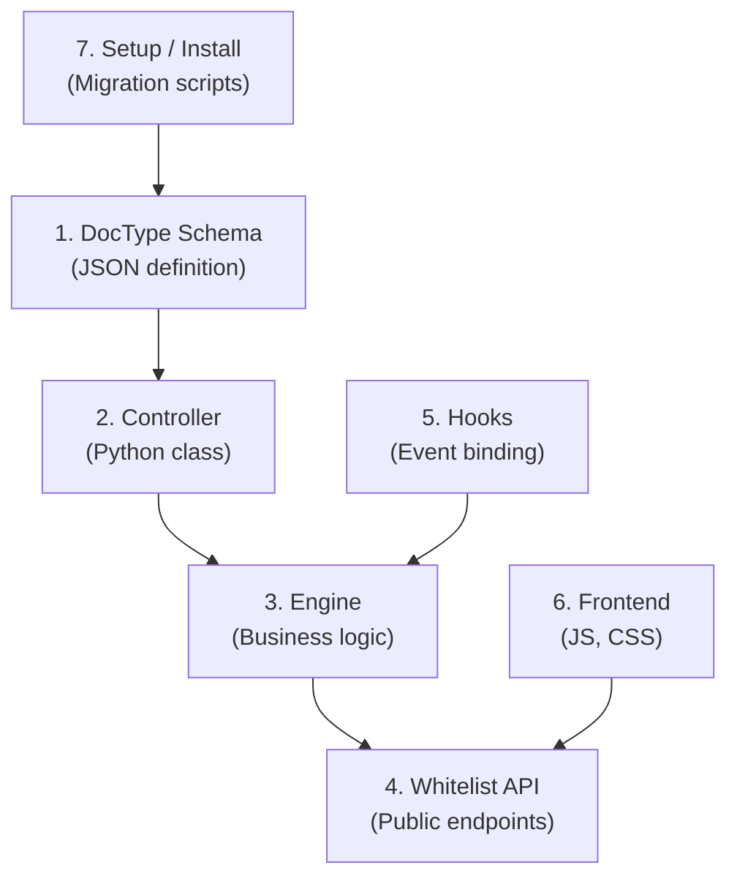

# 🏗️ Kiến trúc Hệ thống

:::info Tóm tắt
Ứng dụng tuân thủ cấu trúc **7-Layer Frappe** — mỗi lớp có trách nhiệm riêng, không vi phạm ranh giới.
:::

## Sơ đồ 7 lớp

## Chi tiết từng lớp

| Lớp | Thư mục / File | Vai trò trong Haravan Helpdesk |
|-----|---------------|-------------------------------|
| **1. DocType Schema** | `login_with_haravan/login_with_haravan/doctype/` | Định nghĩa DocType `haravan_account`, `haravan_account_link` |
| **2. Controller** | `doctype/*/haravan_account.py` | Xử lý lifecycle event của DocType (before_save, validate, v.v.) |
| **3. Engine** | `login_with_haravan/engines/` | Logic nghiệp vụ thuần túy — `sync_helpdesk.py` chứa `upsert_hd_customer`, `create_contact`, `link_account` |
| **4. Whitelist API** | `login_with_haravan/oauth.py` | Endpoint callback OAuth (`login_via_haravan`), API lấy org (`get_user_haravan_orgs`) |
| **5. Hooks** | `login_with_haravan/hooks.py` | Đăng ký `web_include_js`, `after_migrate`, `doc_events` |
| **6. Frontend** | `login_with_haravan/public/js/` | Script giao diện: Vietnamese UI override, custom buttons |
| **7. Setup / Install** | `login_with_haravan/setup/install.py` | Tạo Social Login Key, Custom Fields khi `after_migrate` |

## Nguyên tắc thiết kế

1. **Không sửa Frappe core** hay Frappe Helpdesk core. Mọi tuỳ biến nằm trong custom app.
2. **Engine không import frappe trực tiếp** — nhận dữ liệu đã chuẩn hóa từ API layer.
3. **Whitelist API là cửa ngõ duy nhất** — Client/webhook gọi API, API gọi Engine.
4. **Hooks chỉ đăng ký, không chứa logic** — Hook trỏ đến hàm trong Engine hoặc Setup.
5. **Setup idempotent** — `after_migrate` có thể chạy lại nhiều lần mà không gây lỗi.

## Xem thêm

- [Luồng OAuth & Đăng nhập](/architecture/oauth-flow) — Sequence diagram chi tiết
- [Luồng dữ liệu & Đồng bộ](/architecture/data-flow) — Cách dữ liệu chảy qua các lớp
- [Cơ sở dữ liệu](/architecture/database) — Schema và quan hệ giữa các DocType
