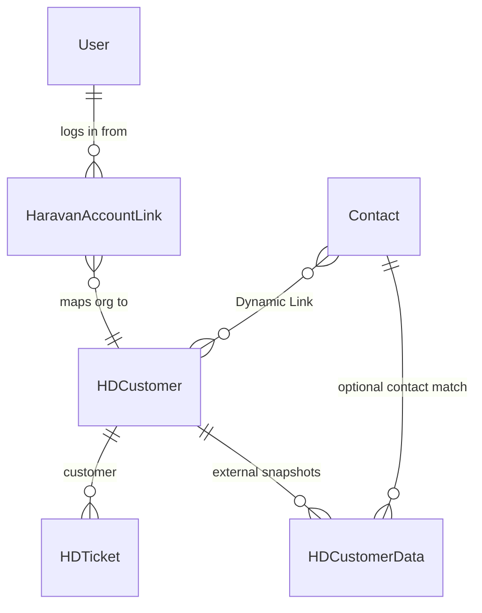

# Haravan.help Helpdesk Data Model

This document helps AI agents understand how the production site `haravan.help`
stores Helpdesk data for tickets, customers, contacts, Haravan identities, and
Bitrix enrichment.

The site is a Frappe Helpdesk instance extended by the custom app
`login_with_haravan`. Do not modify Frappe core or Helpdesk core. Use custom
fields, hooks, Server Scripts, Form Scripts, and the custom DocTypes from this
app.

## Data Flow Summary

1. Customer signs in with Haravan OAuth.
2. `login_with_haravan.oauth.login_via_haravan` normalizes the Haravan profile.
3. The app upserts:
   - `User`
   - `Contact`
   - `HD Customer`
   - `Haravan Account Link`
4. Customer creates a Helpdesk ticket in `/helpdesk/my-tickets/new`.
5. Ticket is stored as `HD Ticket`, linked to `HD Customer` through `customer`.
6. Agent-side customer profile can enrich `HD Customer`, `Contact`, and ticket
   fields from Bitrix on demand.

## Core Relationships



## `HD Ticket`

`HD Ticket` is the primary support ticket DocType from Frappe Helpdesk. The
native Helpdesk fields are owned by the upstream app; the custom fields below
are the fields this project expects or manages.

### Important Native Fields

| Fieldname | Type | Description |
|---|---:|---|
| `name` | Data | Ticket document ID, often displayed as the ticket number. |
| `subject` | Data | Customer-visible issue title. |
| `description` | Text / Editor | Main customer issue description. Treat as user-generated content. |
| `status` | Link / Select | Ticket status used by Helpdesk workflows and list filters. |
| `priority` | Link / Select | Ticket priority. |
| `ticket_type` | Link / Select | Helpdesk ticket type/category when configured. |
| `customer` | Link -> `HD Customer` | The merchant/store/account that owns the ticket. This is the key field for org-level context. |
| `contact` | Link -> `Contact` | Contact person linked to the ticket. |
| `raised_by` | Data | Email/user that raised the ticket. Used as fallback to find `Contact`. |
| `agent_group` | Link -> `HD Team` | Team assignment. Routing scripts can set this from customer segment. |
| `agent` | Link -> `User` | Assigned support agent when Helpdesk assignment is used. |
| `creation` | Datetime | Ticket creation timestamp. |
| `modified` | Datetime | Last modification timestamp. |

### Project Custom Fields On `HD Ticket`

| Fieldname | Type | Description |
|---|---:|---|
| `custom_cc_emails` | Small Text | Ticket-level CC list. Emails are comma-separated. Used by `HDTicketCCMixin` to merge CC recipients into acknowledgement and agent reply emails. |
| `custom_responsible` | Data | Email of the responsible person resolved from Bitrix `user.get` by `ASSIGNED_BY_ID`. Read-only in the app metadata. |
| `custom_product_suggestion` | Link / Data | Product suggestion used by Helpdesk/GitLab automation. Customer portal template keeps it optional; agent workflows may still require it. |
| `custom_internal_type` | Select / Data | Internal ticket classification. When value is `Onboarding Service`, service-related internal fields become relevant. |
| `custom_service_group` | Select | Internal service group for onboarding-service tickets. Hidden from customers in the ticket template. |
| `custom_service_name` | Select | Internal service name for onboarding-service tickets. Hidden from customers. |
| `custom_service_line` | Select | Internal service line for onboarding-service tickets. Hidden from customers. |
| `custom_service_onboarding_phrase` | Select | Internal onboarding phrase/stage for service tickets. Hidden from customers. |
| `custom_service_pricing` | Currency | Internal service price. Hidden from customers. |
| `custom_service_transaction_id` | Data | Internal payment/transaction reference for service tickets. Hidden from customers. |
| `custom_service_vendor` | Select | Internal service provider/vendor. Hidden from customers. |
| `custom_service_payment_status` | Select | Internal payment status. Hidden from customers. |
| `custom_orgid` | Data | Haravan org ID cached on ticket by production scripts. Used by Bitrix routing/profile scripts. |
| `custom_haravan_profile_orgid` | Data | Org ID used for the last Bitrix profile lookup/routing decision. |
| `custom_customer_segment` | Select / Data | Customer segment, typically `SME` or `Medium`. May be copied from `HD Customer.custom_customer_segment` or calculated from Bitrix. |
| `custom_haravan_profile_status` | Data | Bitrix profile lookup status, for example `Complete`, `Skipped`, `Missing OrgID`, or `API Error`. |
| `custom_haravan_profile_error` | Small Text / Text | Last profile lookup/routing error message. |
| `custom_haravan_profile_checked_at` | Datetime | Last timestamp when profile/routing script checked the ticket. |
| `custom_haravan_service_plan` | Data | Current Haravan service/shop plan from Bitrix. |
| `custom_shopplan` | Select / Data | Normalized shop plan bucket such as `SME`, `Medium Grow`, or `Medium Scale`. |
| `custom_haravan_hsi_segment` | Data | HSI segment from Bitrix company fields. |
| `custom_haravan_routing_reason` | Small Text / Text | Human-readable reason for automatic team routing. |

Notes:

- `customer` is intentionally visible in the customer ticket template so the
  portal can choose the correct Haravan organization.
- `custom_cc_emails` is hidden from customer portal templates and mainly for
  agent-created tickets/replies.
- Service/onboarding fields are internal. Do not expose them in customer-facing
  UI unless the product requirement explicitly changes.

## `HD Customer`

`HD Customer` is the Helpdesk-native customer/account entity. For Haravan, one
`HD Customer` normally represents one Haravan organization/store.

### Important Native Fields

| Fieldname | Type | Description |
|---|---:|---|
| `name` | Data | Document ID. In this app it usually follows `"{orgname} - {orgid}"`. |
| `customer_name` | Data | Display name. The app writes `"{orgname} - {orgid}"`. |
| `domain` | Data | Store domain. The app defaults to `"{orgid}.myharavan.com"` when only org ID is known. |
| `image` | Attach Image | Optional customer image/logo if present in Helpdesk. |
| `creation` | Datetime | Customer creation timestamp. |
| `modified` | Datetime | Last modification timestamp. |

### Project Custom Fields On `HD Customer`

| Fieldname | Type | Description |
|---|---:|---|
| `custom_haravan_orgid` | Int | Primary Haravan organization ID. This is the deterministic lookup key for avoiding duplicate `HD Customer` records. |
| `custom_myharavan` | Data | MyHaravan domain, usually `"{orgid}.myharavan.com"`. |
| `custom_bitrix_company_id` | Data | Matched Bitrix company ID. |
| `custom_bitrix_company_url` | Data | Direct URL to the matched Bitrix company. |
| `custom_bitrix_match_confidence` | Percent | Confidence score for the Bitrix match. The app commonly writes `90` or `95`. |
| `custom_bitrix_sync_status` | Data | Bitrix sync status, for example `matched` or `not_found`. |
| `custom_bitrix_last_synced_at` | Datetime | Last time company/contact data was synced from Bitrix. |
| `custom_bitrix_last_checked_at` | Datetime | Last time production metajson/org lookup checked Bitrix, even if no company was found. |
| `custom_bitrix_company_modified_at` | Datetime | Bitrix company modification timestamp when provided by the Bitrix API. |
| `custom_bitrix_not_found_at` | Datetime | Last time Bitrix lookup did not find a matching company. |
| `custom_customer_segment` | Select / Data | Customer segment used by routing, typically `SME` or `Medium`. |

Notes:

- Lookup priority should be `custom_haravan_orgid` first, then exact name.
- Do not create a competing custom organization DocType for ticket ownership;
  `HD Customer` is the canonical Helpdesk entity.
- `custom_customer_segment` may exist from production Server Scripts even if it
  is not declared directly in this app's install hook.

## `Contact`

`Contact` is the Frappe contact person entity. It is upserted from Haravan login
data when an email exists.

| Fieldname | Type | Description |
|---|---:|---|
| `name` | Data | Contact document ID. |
| `first_name` | Data | Name from Haravan profile, or email prefix fallback. |
| `middle_name` | Data | Optional Haravan middle name. |
| `email_id` | Data | Primary email. Used to match existing contacts. |
| `phone` | Data | Phone number if present or later enriched. |
| `mobile_no` | Data | Mobile number if present or later enriched. |
| `links` | Child Table | Dynamic Links. Owner/admin Haravan users are linked to `HD Customer`; staff are not linked for org-wide visibility. |
| `custom_bitrix_contact_id` | Data | Matched Bitrix contact ID. |
| `custom_bitrix_contact_url` | Data | Direct URL to the matched Bitrix contact. |
| `custom_bitrix_last_synced_at` | Datetime | Last Bitrix contact sync timestamp. |

Visibility rule:

- Haravan roles `owner` and `admin` get a `Contact.links` row to `HD Customer`,
  allowing org-level ticket visibility.
- Staff or other roles do not get the org-wide `HD Customer` contact link, so
  they should see only their own tickets in portal behavior.

## `Haravan Account Link`

Custom DocType from this app. It stores the durable mapping between a Frappe
user, a Haravan user, and a Haravan organization.

Autoname is method-based in the controller. Treat records as upserted identity
links, not as free-form CRM records.

| Fieldname | Type | Required | Description |
|---|---:|---:|---|
| `user` | Link -> `User` | Yes | Frappe user account. |
| `email` | Data | Yes | User email from Haravan/Frappe. |
| `last_login` | Datetime | No | Last successful Haravan OAuth login timestamp. |
| `haravan_userid` | Data | Yes | Haravan user ID. |
| `haravan_orgid` | Data | Yes | Haravan organization ID. |
| `haravan_orgname` | Data | No | Haravan organization/store name. |
| `haravan_orgcat` | Data | No | Haravan organization category from profile claims. |
| `haravan_roles` | Small Text | No | Haravan role list serialized as text. |
| `raw_profile` | Code / JSON | No | Raw normalized login profile for troubleshooting. Contains identity data; avoid exposing broadly. |
| `hd_customer` | Link -> `HD Customer` | No | Helpdesk customer created or matched for this org. |

## `HD Customer Data`

Custom DocType from this app. It stores external data snapshots, mainly from
Bitrix company/contact enrichment.

Autoname format:

```text
BTRX-{entity_type}-{external_id}
```

| Fieldname | Type | Required | Description |
|---|---:|---:|---|
| `hd_customer` | Link -> `HD Customer` | Yes | Customer/account that the external entity belongs to. |
| `contact` | Link -> `Contact` | No | Related contact, when the external snapshot is contact-specific. |
| `source` | Data | Yes | External source name. Default is `bitrix`. |
| `entity_type` | Select | Yes | External entity type. Allowed values: `company`, `contact`. |
| `external_id` | Data | Yes | ID in the external system. |
| `external_url` | Data | No | Direct URL to the external record. |
| `match_key` | Data | No | Matching strategy, for example `domain_or_haravan_orgid` or `email_or_phone`. |
| `confidence` | Percent | No | Match confidence. |
| `last_synced_at` | Datetime | No | Last sync timestamp. |
| `summary_json` | Code / JSON | No | JSON snapshot returned by the external API. May contain operational CRM data. |

## `Helpdesk Integrations Settings`

This is a Helpdesk settings DocType extended with Bitrix configuration fields.
These fields are configuration, not ticket/customer business data.

| Fieldname | Type | Description |
|---|---:|---|
| `bitrix_customer_api_section` | Section Break | UI grouping for customer/company API settings. |
| `bitrix_enabled` | Check | Enables or disables Bitrix customer/company profile lookup. |
| `bitrix_webhook_url` | Password | Inbound webhook URL used server-side for Bitrix `crm.company.*`. Never expose to browser or docs with real secret. |
| `bitrix_responsible_api_section` | Section Break | UI grouping for responsible-user API settings. |
| `bitrix_responsible_webhook_url` | Password | Inbound webhook URL used server-side for Bitrix `user.get`. Never expose the real value. |
| `bitrix_portal_url` | Data | Bitrix portal base URL used to build record links. |
| `bitrix_timeout_seconds` | Int | Timeout for Bitrix API calls. Default in metadata is `15`. |
| `bitrix_refresh_ttl_minutes` | Int | Cache/refresh TTL. Default in metadata is `60`. |

## Agent Operating Rules

- Use Frappe APIs or REST resource APIs. Avoid raw SQL unless there is no safer
  ORM path.
- If raw SQL is required, use parameterized queries only.
- Log server-side exceptions with `frappe.log_error()`, not `frappe.logger`.
- API responses should follow:

```json
{"success": true, "data": {}, "message": "Human-readable message."}
```

- Treat these fields as sensitive or semi-sensitive:
  - `Helpdesk Integrations Settings.bitrix_webhook_url`
  - `Helpdesk Integrations Settings.bitrix_responsible_webhook_url`
  - `Haravan Account Link.raw_profile`
  - `HD Customer Data.summary_json`
- Do not translate or rewrite user-generated ticket fields such as `subject`
  and `description`.
- For Haravan org identity, prefer this lookup order:
  1. `HD Customer.custom_haravan_orgid`
  2. `Haravan Account Link.haravan_orgid`
  3. `HD Ticket.custom_orgid`
  4. `HD Customer.domain` / `custom_myharavan`

## Quick Query Patterns

Find a customer by Haravan org ID:

```python
customer = frappe.db.get_value(
    "HD Customer",
    {"custom_haravan_orgid": int(orgid)},
    ["name", "customer_name", "domain"],
    as_dict=True,
)
```

Find a ticket's customer profile:

```python
ticket = frappe.db.get_value(
    "HD Ticket",
    ticket_name,
    ["name", "customer", "contact", "raised_by", "custom_orgid"],
    as_dict=True,
)
```

Find Haravan orgs linked to a user:

```python
links = frappe.get_all(
    "Haravan Account Link",
    filters={"user": user},
    fields=["haravan_orgid", "haravan_orgname", "haravan_roles", "hd_customer"],
)
```

Find Bitrix snapshots for a customer:

```python
rows = frappe.get_all(
    "HD Customer Data",
    filters={"hd_customer": hd_customer, "source": "bitrix"},
    fields=["entity_type", "external_id", "external_url", "confidence", "last_synced_at"],
)
```

## Source Of Truth In This Repository

| Area | File |
|---|---|
| Custom field creation | `login_with_haravan/setup/install.py` |
| Haravan -> Helpdesk sync | `login_with_haravan/engines/sync_helpdesk.py` |
| Bitrix customer profile enrichment | `login_with_haravan/engines/customer_enrichment.py` |
| Ticket CC behavior | `login_with_haravan/overrides/hd_ticket.py` |
| `Haravan Account Link` schema | `login_with_haravan/login_with_haravan/doctype/haravan_account_link/haravan_account_link.json` |
| `HD Customer Data` schema | `login_with_haravan/login_with_haravan/doctype/hd_customer_data/hd_customer_data.json` |
| Production routing Server Script template | `scripts/deploy_profile_ticket_routing.py` |
| Production metajson/Bitrix enrichment script | `scripts/deploy_bitrix_metajson_enrichment.py` |
