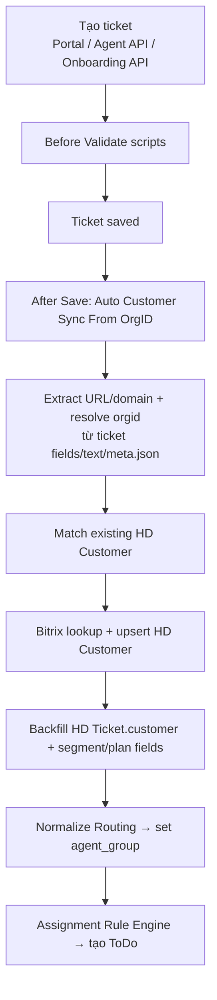
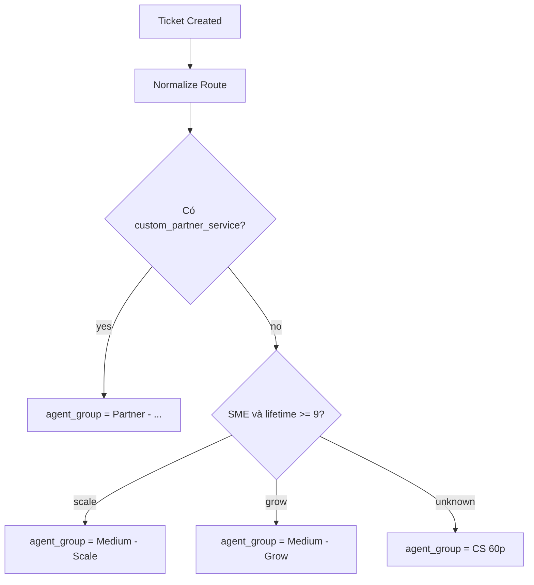

# Luồng Enrichment, Routing & Assignment

> Cập nhật: 2026-05-10 | Source of truth: Production scripts trên haravan.help

## Tổng quan luồng

## 1. Tạo ticket

### Nhánh A: Onboarding API
- Script: `Onboarding - Create Ticket API`
- Input: `company_name`, `customer_email`, `contact_phone`, `custom_store_url`
- Idempotency: theo `custom_bitrix_deal_id`

### Nhánh B: Agent tạo từ dialog
- Client: `Onboarding - Agent Ticket Dialog`
- API: `Onboarding - Agent Ticket API`
- Input: `customer_email`, `contact_phone`, `custom_store_url`, `subject`, `description`, `custom_product_suggestion`

### Nhánh C: Portal/email thông thường
- Ticket đi theo flow Helpdesk chuẩn
- Không có hard validation bắt buộc customer/store_url

## 2. Validation (trước khi lưu)

| Script | Hành vi | Blocking? |
|---|---|---|
| Contact Phone Validate | Normalize số điện thoại best-effort | ❌ Không chặn |
| Normalize Intake Selects | Dọn giá trị select stale/invalid | ❌ Không chặn |
| Product Suggestion Map | Map suggestion → product_line + product_feature | ❌ Không chặn |

::: info Nguyên tắc
Tất cả validation hiện tại đều **non-blocking** — không bao giờ chặn tạo ticket.
:::

## 3. Làm giàu dữ liệu (Enrichment)

### Tự động sau save

Script: `Auto Customer Sync From OrgID` (After Save)

1. Parse và normalize `custom_store_url`/domain
2. Gọi `meta.json` theo host hợp lệ để lấy orgid (**meta-first**)
3. Fallback: đọc field legacy, scan subject/description
4. **Domain guard**: bỏ qua domain dễ nhầm (google.com, shopify.com, ...)
5. Ngoại lệ: `myharavan.com` và `*.myharavan.com` luôn được xử lý
6. Tìm `HD Customer` theo orgid/domain (local-first)
7. Bitrix chỉ gọi khi local thiếu dữ liệu routing

### Segment mapping

| Nguồn | Giá trị | Segment |
|---|---|---|
| Bitrix `UF_CRM_1778130421650` | `15090` | SME |
| Bitrix `UF_CRM_1778130421650` | `15092` | Medium |
| Bitrix `UF_CRM_1778130421650` | `15094` | Enterprise |
| HSI `500+` hoặc shopplan `Grow`/`Scale` | — | Medium |
| Fallback | — | SME |

## 4. Routing (Normalize → agent_group)

### Quy tắc quan trọng

- `custom_service_group` là **Select field** (CODE: `Ecom`, `Ads`, `Design`...)
- `agent_group` là **Link field** (tên team: `Service Ecom`, `CS 60p`, `Sale`...)
- Script routing là **layer mapping duy nhất**: CODE `Ecom` → team `Service Ecom`
- Chỉ route sang `Service Ecom` khi có **3 điều kiện AND**:
  1. `custom_service_group == "ecom"` (lowercase exact)
  2. Có `customer` hoặc `custom_orgid` (basic evidence)
  3. Có `custom_partner_service` hoặc `custom_current_shopplan` (Bitrix evidence)
- Thiếu evidence → fallback `CS 60p`

## 5. Assignment Rules

| Rule | Priority | Điều kiện |
|---|---|---|
| Partner - ... - Support Rotation | Cao nhất | `agent_group == "Partner - ..."` |
| AR02 - SME 9M Scale | 300 | `agent_group == "Medium - Scale"` |
| AR03 - SME 9M Grow | 200 | `agent_group == "Medium - Grow"` |
| AR04 - CS60p Fallback | 100 | `agent_group == "CS 60p"` |

## 6. Lưu ý vận hành

1. **First insert vs re-save**: First insert có thể thiếu evidence (enrichment chưa xong), re-save sẽ có đầy đủ
2. **Bitrix fail → graceful fallback**: Bitrix down → 2 field business rỗng → gate fail → CS 60p
3. **AI không route trực tiếp**: AI có thể ghi `custom_service_group` nhưng routing yêu cầu Bitrix evidence
4. **Không dùng `doc.save()`** trong After Save — chỉ `frappe.db.set_value(update_modified=False)`

## Tham chiếu

- [Script Catalog](/operations/script-catalog) — Registry đầy đủ
- [safe_exec Gotchas](/architecture/safe-exec) — Lưu ý RestrictedPython
- [Data Model](/architecture/data-model) — Entity và field contracts
