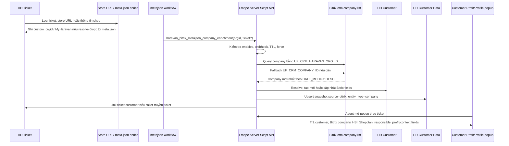

# Luồng metajson, Bitrix và Customer Profit

## 1. Mục tiêu thay đổi

Nhóm thay đổi gần đây gom dữ liệu khách hàng quanh một khóa chính là Haravan `orgid` / Company ID. Khi ticket hoặc workflow metajson có `orgid`, hệ thống có thể gọi Bitrix server-side để làm giàu hồ sơ, cập nhật `HD Customer`, link lại `HD Ticket`, routing ticket theo segment, và giúp popup Customer Profit/Profile hiển thị dữ liệu đúng hơn cho agent.

Các thay đổi không đưa secret Bitrix ra browser. Browser chỉ gọi Frappe API hoặc HD Form Script; webhook Bitrix vẫn nằm server-side trong `Helpdesk Integrations Settings`.

## 2. Thành phần liên quan

| Thành phần | Tên production | Vai trò |
| --- | --- | --- |
| HD Form Script | `Profile - Ticket Customer Button` | Thêm menu Customer Profile / Refresh Bitrix Profile / đồng bộ customer từ popup |
| Server Script API | `Profile - Bitrix Customer API` | Lấy hồ sơ Bitrix theo ticket để hiển thị popup |
| Server Script API | `Metajson - Bitrix Company Enrichment API` | Làm giàu `HD Customer` khi metajson có `orgid` |
| Server Script Event | `Profile - Ticket Routing` | Routing `HD Ticket` theo `custom_customer_segment` |
| Server Script / ticket intake | `Ticket - Store URL Enrich` | Đọc store URL / `meta.json`, map OrgID/MyHaravan vào ticket |
| Single DocType | `Helpdesk Integrations Settings` | Lưu cấu hình Bitrix: webhook, portal URL, timeout, TTL |
| DocType | `HD Customer` | Hồ sơ khách hàng đã enrich |
| DocType | `HD Customer Data` | Snapshot payload Bitrix theo source/entity/external id |
| DocType | `HD Ticket` | Ticket được link customer, cập nhật profile fields và routing |

Source-controlled scripts chính:

- `scripts/deploy_bitrix_metajson_enrichment.py`
- `scripts/patch_profile_sync_company_id.py`
- `scripts/deploy_profile_ticket_routing.py`

## 3. Luồng tổng quan



## 4. Luồng làm giàu từ meta.json

`meta.json` là nguồn giúp hệ thống biết ticket thuộc shop/org nào. Luồng intake hoặc enrichment đọc store URL, MyHaravan hoặc metadata liên quan để tìm Haravan `orgid`; sau đó ghi vào các field ticket như `custom_orgid` và các field profile tương ứng nếu có.

Khi workflow metajson có `orgid`, nó gọi:

```text
POST /api/method/haravan_bitrix_metajson_company_enrichment
```

Tham số quan trọng:

| Tham số | Mục đích |
| --- | --- |
| `orgid` | Khóa lookup Bitrix company |
| `force` | Bỏ qua TTL để ép kiểm tra lại Bitrix |
| `hd_customer` | Customer đã biết sẵn, nếu caller đã resolve được |
| `ticket` / `ticket_name` / `hd_ticket` | Ticket cần link vào customer sau enrichment |

API này là Server Script an toàn cho safe_exec: không import custom app runtime, không gọi helper nested, và trả response chuẩn `{"success": bool, "data": {}, "message": str}`.

## 5. Luồng gọi Bitrix

Server Script đọc cấu hình từ `Helpdesk Integrations Settings`:

- `bitrix_enabled`
- `bitrix_webhook_url`
- `bitrix_portal_url`
- `bitrix_timeout_seconds`
- `bitrix_refresh_ttl_minutes`

Thứ tự lookup Bitrix:

1. Gọi `crm.company.list.json` với filter `UF_CRM_HARAVAN_ORG_ID = orgid`.
2. Nếu không có kết quả, fallback sang `UF_CRM_COMPANY_ID = orgid`.
3. Select `*`, `UF_*`, `EMAIL`, `PHONE`, `WEB`.
4. Order theo `DATE_MODIFY DESC`, lấy record đầu tiên nếu có nhiều company.

Guard chống gọi lặp:

| Guard | Cách hoạt động |
| --- | --- |
| Thiếu `orgid` | Trả `missing_orgid`, không log lỗi |
| Bitrix tắt | Trả `disabled` |
| Thiếu webhook | Trả `missing_config` |
| Trong TTL | Trả `cached`, không gọi Bitrix |
| Bitrix không có company | Ghi `custom_bitrix_last_checked_at` / `custom_bitrix_not_found_at` nếu có field |
| Có company | So field và `DATE_MODIFY`, chỉ save khi cần |

## 6. Cập nhật HD Customer

Khi Bitrix trả company, hệ thống resolve `HD Customer` theo thứ tự:

1. `hd_customer` truyền từ caller.
2. `HD Ticket.customer` nếu caller truyền ticket.
3. `HD Customer.custom_haravan_orgid = orgid`.
4. `HD Customer.custom_bitrix_company_id = Bitrix ID`.
5. Nếu chưa có customer, tạo customer mới từ tên company và orgid.

Các field được cập nhật nếu DocType có field tương ứng:

| Field | Ý nghĩa |
| --- | --- |
| `custom_haravan_orgid` | Haravan org id / Company ID |
| `custom_myharavan` | Domain MyHaravan suy ra từ orgid hoặc dữ liệu shop |
| `custom_bitrix_company_id` | Internal Bitrix company ID |
| `custom_bitrix_company_url` | Link mở Bitrix CRM company details |
| `custom_bitrix_match_confidence` | Độ tin cậy match, hiện dùng `95` khi match bằng orgid |
| `custom_bitrix_sync_status` | Trạng thái sync, ví dụ `matched` |
| `custom_bitrix_last_synced_at` | Lần cuối đồng bộ dữ liệu matched |
| `custom_bitrix_last_checked_at` | Lần cuối kiểm tra Bitrix, kể cả cache/no result |
| `custom_bitrix_company_modified_at` | `DATE_MODIFY` mới nhất từ Bitrix |
| `custom_bitrix_not_found_at` | Lần cuối Bitrix không tìm thấy company |

Nếu có DocType `HD Customer Data`, API upsert thêm snapshot:

- `source = bitrix`
- `entity_type = company`
- `external_id = Bitrix company ID`
- `external_url = company_url`
- `match_key = haravan_orgid:<lookup_field>`
- `confidence = 95`
- `summary_json = raw Bitrix company payload`

## 7. Cập nhật HD Ticket

Có hai nhóm cập nhật ticket.

### 7.1 Link ticket vào customer

Nếu API metajson nhận tham số `ticket`, script sẽ kiểm tra `HD Ticket` và set:

```text
HD Ticket.customer = resolved HD Customer
```

Response trả thêm:

```json
{
  "ticket": {
    "name": "61111",
    "linked": true,
    "previous_customer": "old customer name"
  }
}
```

Điểm quan trọng của patch gần đây: popup Customer Profile sau khi match Bitrix sẽ truyền `company.company_id` vào API sync. Nhờ vậy action đồng bộ dùng đúng company đã match trong popup, thay vì chỉ đọc `custom_orgid` trống trên ticket rồi báo lỗi `Ticket has no Haravan Company ID`.

### 7.2 Routing ticket theo segment

Server Script `Profile - Ticket Routing` chạy ở `HD Ticket / Before Save`.

Thứ tự lấy segment:

1. Ưu tiên `HD Customer.custom_customer_segment`.
2. Nếu ticket cache đúng orgid, dùng `HD Ticket.custom_customer_segment`.
3. Nếu chưa có segment, gọi Bitrix theo `custom_orgid`.
4. Nếu không có orgid, Bitrix tắt, thiếu config, không tìm thấy hoặc lỗi API, default về `SME`.

Quy tắc segment hiện tại:

| Điều kiện Bitrix | Segment |
| --- | --- |
| `UF_CRM_CURRENT_SHOPPLAN` chứa `grow` hoặc `scale` | `Medium` |
| `UF_CRM_LAST_HSI_SEGMENT = HSI_500+` | `Medium` |
| Còn lại | `SME` |

Routing team:

| Segment | Agent group |
| --- | --- |
| `Medium` | `Medium` |
| `SME` | `CS 60p` |

Script chỉ tự đổi `agent_group` nếu group hiện tại nằm trong danh sách auto-routed: rỗng, `Medium`, `CS 60p`, `After Sales`, `Service Ecom`. Nếu agent đã gán group thủ công ngoài danh sách này, script giữ nguyên group và chỉ cập nhật lý do routing.

Các field ticket liên quan:

| Field | Ý nghĩa |
| --- | --- |
| `custom_customer_segment` | Segment cuối cùng dùng cho routing |
| `custom_haravan_profile_orgid` | Orgid đã dùng khi profile/routing chạy |
| `custom_haravan_profile_status` | `Complete`, `Skipped`, `Missing OrgID`, `API Error` |
| `custom_haravan_profile_error` | Lý do skip/lỗi ngắn gọn |
| `custom_haravan_profile_checked_at` | Thời điểm kiểm tra |
| `custom_haravan_service_plan` | Shopplan hiện tại từ Bitrix |
| `custom_shopplan` | Nhóm shopplan rút gọn |
| `custom_haravan_hsi_segment` | HSI segment hiện tại |
| `custom_haravan_routing_reason` | Lý do route, gồm source và dữ liệu Bitrix |

## 8. Popup Customer Profit/Profile

Popup trên ticket vẫn đi qua HD Form Script `Profile - Ticket Customer Button`, không gọi Bitrix trực tiếp từ browser.

Luồng khi agent mở popup:

1. Form script gọi `haravan_bitrix_customer_profile` với `ticket`.
2. Server Script đọc ticket, customer, contact và các candidate Company ID.
3. Server Script gọi Bitrix nếu cần, normalize company/contact/responsible.
4. Popup render các nhóm dữ liệu như `HD Customer`, `Contact`, `Bitrix Company`, `HSI`, `Shopplan`, `Bitrix Contact` và các metric/profit/context fields nếu API trả về trong payload.
5. Khi agent bấm đồng bộ từ popup, form script truyền company id đã match vào sync API để cập nhật đúng customer/ticket.

Nguyên tắc hiển thị:

- Popup chỉ render dữ liệu đã được server trả về.
- Không expose webhook/token Bitrix ra browser.
- Nếu Bitrix `not_found` hoặc `error`, popup vẫn phải mở được và hiển thị trạng thái rõ ràng.
- Dữ liệu profit nên được coi là context vận hành; nguồn chính vẫn là payload Bitrix/metajson đã được normalize server-side.

## 9. Failure modes đã xử lý

| Tình huống | Hành vi mong đợi |
| --- | --- |
| Ticket không có `custom_orgid` | Routing default SME, ghi `Missing OrgID`; popup có thể fallback theo customer/contact nếu API hỗ trợ |
| Popup match được Bitrix nhưng ticket thiếu orgid | Sync action truyền `company.company_id` từ popup để không lỗi |
| Bitrix webhook thiếu | Enrichment trả `missing_config`, routing default SME |
| Bitrix timeout/lỗi API | Ghi trạng thái `API Error`, không chặn save ticket |
| Bitrix không có company | Ghi checked/not_found guard, default SME nếu dùng cho routing |
| Agent đã route thủ công | Không override `agent_group` ngoài danh sách auto-routed |
| Gọi metajson liên tục | TTL guard trả `cached`, giảm API cost và loop writes |

## 10. Kiểm thử liên quan

Regression tests đã thêm:

- `login_with_haravan/tests/test_bitrix_metajson_server_script.py`
- `login_with_haravan/tests/test_profile_sync_company_id_patch.py`
- `login_with_haravan/tests/test_profile_ticket_routing_server_script.py`

Lệnh kiểm tra:

```bash
PYTHONPATH=. python3 -m unittest discover -s login_with_haravan/tests -v
python3 -m compileall -q login_with_haravan
./test_gate.sh
```

Smoke test production nên kiểm tra đủ 4 điểm:

1. Ticket có `custom_orgid` hoặc resolve được orgid từ meta.json.
2. API `haravan_bitrix_metajson_company_enrichment` trả `matched` hoặc `cached`.
3. `HD Customer` có Bitrix fields và `HD Customer Data` có snapshot.
4. Popup Customer Profit/Profile mở được, đồng bộ không báo thiếu Company ID, ticket được link đúng customer và route đúng segment.
