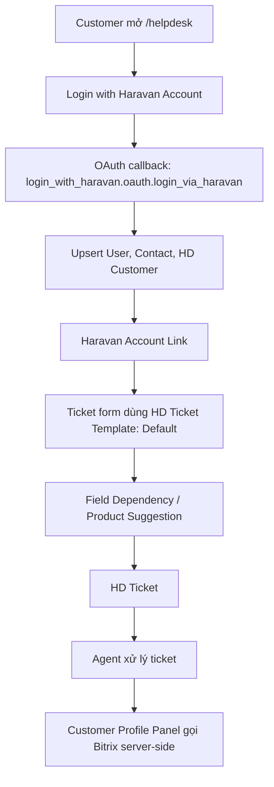

# Bàn giao vận hành Haravan Helpdesk

Tài liệu này dành cho nhân viên Haravan tiếp nhận hệ thống Helpdesk tại:

[https://haravan.help](https://haravan.help)

Frappe Cloud site slug: `haravandesk.s.frappe.cloud`.

Mục tiêu là giúp người vận hành hiểu hệ thống đang chạy theo mô hình nào, vào đâu để cấu hình form ticket, sản phẩm gợi ý, quyền khách hàng, token tích hợp, và khi nào cần chuyển việc sang đội kỹ thuật.

:::warning Quy tắc an toàn
Không dán token, client secret, webhook URL có secret, access token hoặc private key vào tài liệu, ticket, chat, Client Script, HD Form Script hoặc Git. Tài liệu chỉ ghi tên key và quy trình.
:::

## 1. Mô hình hoạt động

Luồng chính của Haravan Helpdesk gồm 5 lớp:

1. Khách hàng đăng nhập bằng Haravan Account.
2. App `login_with_haravan` nhận OAuth callback, tạo hoặc cập nhật `User`, `Contact`, `HD Customer` và `Haravan Account Link`.
3. Khi khách tạo ticket, `HD Ticket Template` quyết định form hiển thị field nào; Field Dependency quyết định field con phụ thuộc field cha.
4. Agent xử lý ticket trong Frappe Helpdesk; Customer Profile panel có thể lấy thêm dữ liệu Bitrix theo nhu cầu.
5. AI, GitLab, Bitrix và các tích hợp khác đọc token từ Frappe Cloud Site Config qua server-side code hoặc Server Script.



### Quy ước dữ liệu khách hàng

- `HD Customer` đại diện cho tổ chức/cửa hàng Haravan.
- Tên `HD Customer` được tạo theo mẫu: `[OrgID] - [OrgName]`, ví dụ `12345 - Minh Hai Store`.
- `Haravan Account Link` nối `User` Frappe với `haravan_userid`, `haravan_orgid` và `HD Customer`.
- `Contact.links` nối một người với `HD Customer`. Với Haravan role `owner` hoặc `admin`, Contact được link vào `HD Customer` để xem ticket toàn tổ chức. Với `staff`, Contact không được link org-wide, nên chỉ thấy ticket do chính mình tạo.

## 2. Cấu hình form tạo ticket

Trang cấu hình chính:

[HD Ticket Template - Default](https://haravan.help/desk/hd-ticket-template/Default)

`HD Ticket Template` quyết định field nào xuất hiện khi khách tạo ticket trên Helpdesk portal. Frappe Helpdesk yêu cầu custom field phải được tạo trên `HD Ticket` trước, sau đó mới thêm field đó vào template `Default`. Tài liệu chính thức của Frappe Helpdesk cũng ghi rõ field dependency chỉ hỗ trợ field type `Select` hoặc `Link`, và các field tham gia dependency phải được thêm vào template `Default`: [Field Dependency](https://docs.frappe.io/helpdesk/field-dependency).

### Thêm field mới vào form ticket

1. Vào Desk, mở `DocType` hoặc `Customize Form` của `HD Ticket`.
2. Tạo field mới, ví dụ:
   - `custom_product`: sản phẩm/dịch vụ.
   - `custom_issue_group`: nhóm vấn đề.
   - `custom_issue_detail`: chi tiết vấn đề.
   - `custom_store_url`: URL cửa hàng.
3. Ghi lại chính xác `fieldname`, không dùng label để cấu hình template.
4. Mở `HD Ticket Template > Default`.
5. Trong bảng `Fields`, thêm từng `fieldname` cần khách nhập.
6. Tick `Required` nếu bắt buộc.
7. Tick `Hide from customer` nếu field chỉ dành cho agent hoặc automation nội bộ.
8. Lưu template, clear cache nếu portal chưa hiện field.

### Cấu hình dependent fields

Field dependency dùng khi giá trị field con phụ thuộc vào field cha, ví dụ:

| Parent field | Child field | Ý nghĩa |
| --- | --- | --- |
| `custom_product` | `custom_issue_group` | Mỗi sản phẩm có nhóm vấn đề riêng |
| `custom_issue_group` | `custom_issue_detail` | Mỗi nhóm vấn đề có danh sách lỗi riêng |
| `ticket_type` | `priority` | Loại ticket ảnh hưởng mức ưu tiên |

Có 2 cách cấu hình:

1. Portal Settings:
   - Mở Helpdesk.
   - User menu > Settings > Field Dependencies.
   - Tạo dependency mới.
   - Chọn parent field và child field.
   - Map từng giá trị parent sang danh sách giá trị child được phép chọn.
2. `HD Form Script`:
   - Dùng khi logic phức tạp hơn UI Field Dependency.
   - Chỉ viết logic hiển thị, filter, validate nhẹ.
   - Không đặt token hoặc gọi API bên thứ ba trực tiếp trong script chạy trên browser.

Checklist sau khi chỉnh:

- Cả parent và child đều có trong `HD Ticket Template > Default`.
- Field type của parent/child là `Select` hoặc `Link`.
- Nếu child là required, đảm bảo mọi giá trị parent hợp lệ đều có ít nhất một lựa chọn child.
- Test trên `/helpdesk/my-tickets/new` bằng user khách hàng thật hoặc user test có cùng quyền.

## 3. Cấu hình HD Ticket Product Suggestion

Trang cấu hình:

[HD Ticket Product Suggestion](https://haravan.help/desk/hd-ticket-product-suggestion)

Phần này là cấu hình nghiệp vụ trên Frappe/Helpdesk site, không nằm trong custom app `login_with_haravan`. Dùng nó để chuẩn hóa cách hệ thống gợi ý hoặc chọn sản phẩm khi khách tạo ticket hoặc khi agent phân loại ticket.

### Cách vận hành đề xuất

Mỗi record nên đại diện cho một luật gợi ý:

| Thành phần | Cách dùng |
| --- | --- |
| Product/Sản phẩm | Tên sản phẩm hoặc module Haravan cần gợi ý |
| Keywords/Từ khóa | Cụm từ khách thường dùng trong subject/description |
| Condition/Điều kiện | Field ticket hoặc nhóm issue áp dụng luật |
| Priority/Thứ tự ưu tiên | Luật cụ thể đặt ưu tiên cao hơn luật rộng |
| Enabled/Bật tắt | Tắt luật cũ trước khi xóa nếu còn cần audit |

Nếu màn hình production có tên field khác, ưu tiên label và help text đang hiển thị trên site. Nguyên tắc vẫn là: record càng cụ thể thì ưu tiên càng cao, keyword càng rõ thì ít gợi ý sai.

### Quy trình thêm hoặc sửa gợi ý sản phẩm

1. Mở `HD Ticket Product Suggestion`.
2. Tìm xem sản phẩm/keyword đã có record tương tự chưa.
3. Nếu thêm mới, tạo record với tên dễ hiểu, ví dụ `Omni - Dong bo don hang`.
4. Điền sản phẩm cần gợi ý và nhóm keyword.
5. Nếu có trường điều kiện, giới hạn theo `ticket_type`, `custom_product`, `custom_issue_group` hoặc field tương đương.
6. Lưu, sau đó tạo ticket test với subject/description chứa keyword.
7. Nếu gợi ý sai quá rộng, giảm keyword chung chung và tăng điều kiện.
8. Nếu cần xóa, ưu tiên disable trước; chỉ xóa khi chắc không cần lịch sử cấu hình.

### Khi nào cần đội kỹ thuật

- Cần gợi ý dựa trên dữ liệu ngoài Frappe.
- Cần gọi AI để phân loại tự động.
- Cần đồng bộ danh mục sản phẩm từ Haravan hoặc Bitrix.
- Cần ghi kết quả suggestion vào field mới của `HD Ticket`.

## 4. Script đang chạy và ý nghĩa

Các script thuộc custom app được nhúng bằng `login_with_haravan/hooks.py`.

| Script/hook | Chạy khi nào | Ý nghĩa |
| --- | --- | --- |
| `haravan_login_redirect.js` | Trang `/login` | Giữ lại đường dẫn Helpdesk khách đang mở, tránh đăng nhập xong bị về `/desk`. |
| `haravan_org_selector.js` | Trang tạo ticket portal | Lấy danh sách org Haravan của user và hiển thị dropdown `Tổ chức / Cửa hàng Haravan` nếu user có nhiều org. |
| `customer_profile_panel.js` | Trang ticket của agent | Khi agent bấm Contact trên ticket, mở panel hồ sơ khách hàng và gọi API server-side để lấy Bitrix data. |
| `HD Ticket.before_insert` | Khi tạo `HD Ticket` | Nếu user chỉ có 1 `HD Customer`, tự set `customer` cho ticket. |
| `after_install` / `after_migrate` | Cài app hoặc migrate | Tạo/cập nhật `Social Login Key` Haravan và custom fields cho `HD Customer`, `Contact`. |

API/server code chính:

| File | Vai trò |
| --- | --- |
| `login_with_haravan/oauth.py` | OAuth callback, lưu `Haravan Account Link`, API `get_user_haravan_orgs`. |
| `login_with_haravan/engines/sync_helpdesk.py` | Tạo/cập nhật `HD Customer`, `Contact`, phân quyền org-wide theo role Haravan. |
| `login_with_haravan/customer_profile.py` | API cho Customer Profile panel. |
| `login_with_haravan/engines/customer_enrichment.py` | Lấy Bitrix data theo nhu cầu, ghi custom fields và `HD Customer Data`. |
| `login_with_haravan/engines/site_config.py` | Đọc token/secret từ Site Config, trả diagnostic masked. |

### Khi cần chỉnh sửa hoặc nâng cấp script

Phân loại trước khi sửa:

| Nhu cầu | Nơi sửa |
| --- | --- |
| Thêm field hiển thị trên form ticket | `HD Ticket` custom field + `HD Ticket Template > Default` |
| Thay đổi lựa chọn phụ thuộc nhau | Field Dependencies hoặc `HD Form Script` |
| Thay đổi org selector, redirect, Customer Profile panel | Source code trong `login_with_haravan/public/js/` |
| Thay đổi cách tạo `HD Customer`, `Contact`, quyền org-wide | `login_with_haravan/engines/sync_helpdesk.py` |
| Thêm tích hợp server-side cần token | Custom app Python hoặc Server Script đọc Site Config |

Quy trình an toàn:

1. Backup hoặc chụp lại cấu hình hiện tại.
2. Test trên staging/local trước nếu sửa source code.
3. Không sửa trực tiếp Frappe core hoặc Helpdesk core.
4. Không đưa token vào script browser.
5. Chạy test gate trước khi ship source code:

```bash
npm run test
```

6. Ship bằng script của repo:

```bash
npm run ship
```

## 5. Cấu hình token AI, GitLab, Bitrix, Haravan OAuth

Tất cả secret đặt tại:

```text
Frappe Cloud > Sites > haravandesk.s.frappe.cloud > Site Config > Add Config > Custom Key
```

### Haravan OAuth

Key ưu tiên:

```text
haravan_account_login
```

Value mẫu:

```json
{
  "client_id": "HARAVAN_CLIENT_ID",
  "client_secret": "HARAVAN_CLIENT_SECRET"
}
```

Nếu cần ép domain callback mà không migrate/setup, thêm `redirect_uri` vào JSON trên.

Redirect URL phải khớp chính xác trong Haravan Partner Dashboard:

```text
https://haravan.help/api/method/login_with_haravan.oauth.login_via_haravan
```

### AI

Các key đang được chuẩn hóa:

| Nhà cung cấp | Site Config key |
| --- | --- |
| Gemini | `gemini_api_key`, `gemini_model` |
| OpenRouter | `openrouter_api_key` |

`gemini_model` không phải secret nhưng nên để cùng Site Config để dễ vận hành. Nếu còn Settings DocType cũ chứa API key, chỉ dùng làm fallback migration; sau khi smoke test pass, xóa secret khỏi Settings DocType cũ.

### Bitrix

Các key:

```text
bitrix_webhook_url
bitrix_access_token
bitrix_refresh_token
bitrix_client_id
bitrix_client_secret
bitrix_base_url
bitrix_domain
bitrix_enabled
bitrix_timeout_seconds
bitrix_refresh_ttl_minutes
```

Cách cấu hình:

- Nếu dùng webhook URL: cấu hình `bitrix_webhook_url`.
- Nếu dùng OAuth/access token: cấu hình `bitrix_base_url` và `bitrix_access_token`.
- `bitrix_enabled = 1` để bật enrichment.
- `bitrix_timeout_seconds` mặc định code đang dùng là `15`.
- `bitrix_refresh_ttl_minutes` mặc định code đang dùng là `60`.

Smoke test:

1. Mở một ticket đã có `HD Customer`.
2. Bấm vùng Contact/Customer để mở Customer Profile panel.
3. Panel hiển thị `Bitrix Company` hoặc trạng thái `not_found`, `missing_config`, `error`.
4. Nếu matched, `HD Customer` có `custom_bitrix_company_id` và `custom_bitrix_last_synced_at`.

### GitLab

Các key:

```text
gitlab_token
gitlab_base_url
```

Quy tắc:

- Client Script hoặc HD Form Script chỉ gọi backend API nội bộ.
- Token GitLab chỉ được đọc server-side.
- Nếu rotate token, test lại luồng search/create/link issue từ ticket.

### Diagnostic sau khi đổi token

Chạy diagnostic masked bằng quyền System Manager:

```text
login_with_haravan.diagnostics.get_haravan_login_status
```

Kết quả chỉ được phép trả trạng thái kiểu `configured`, `source`, `has_client_secret`; không được trả plaintext secret.

## 6. Phụ lục DocType và custom fields

### DocTypes quan trọng

| DocType | Nguồn | Dùng để làm gì |
| --- | --- | --- |
| `HD Ticket` | Helpdesk core | Ticket hỗ trợ khách hàng. |
| `HD Ticket Template` | Helpdesk core | Quy định field nào hiện trên form tạo ticket. |
| `HD Ticket Template Field` | Helpdesk core | Child table trong template. |
| `HD Form Script` | Helpdesk core | Script chạy trên form Helpdesk, gồm Field Dependency auto-generated. |
| `HD Ticket Product Suggestion` | Helpdesk/site config | Luật gợi ý sản phẩm cho ticket. |
| `HD Customer` | Helpdesk core | Tổ chức/cửa hàng khách hàng. |
| `Contact` | Frappe core | Người liên hệ; có child table `links` tới `HD Customer`. |
| `Haravan Account Link` | Custom app | Mapping user Haravan với User/HD Customer Frappe. |
| `HD Customer Data` | Custom app | Snapshot dữ liệu enrich từ Bitrix. |
| `Social Login Key` | Frappe core | Provider `haravan_account` cho OAuth. |

### Custom fields do app tạo

`HD Customer`:

| Fieldname | Type | Ý nghĩa |
| --- | --- | --- |
| `custom_haravan_orgid` | Int | Org ID Haravan, dùng để tìm đúng customer khi org đổi tên. |
| `custom_myharavan` | Data | Domain MyHaravan dạng `<orgid>.myharavan.com`. |
| `custom_bitrix_company_id` | Data | ID công ty match trong Bitrix. |
| `custom_bitrix_company_url` | Data | URL mở công ty Bitrix. |
| `custom_bitrix_match_confidence` | Percent | Độ tin cậy match. |
| `custom_bitrix_sync_status` | Data | Trạng thái sync: `matched`, `not_found`, `error`, v.v. |
| `custom_bitrix_last_synced_at` | Datetime | Lần enrich Bitrix gần nhất. |

`Contact`:

| Fieldname | Type | Ý nghĩa |
| --- | --- | --- |
| `custom_bitrix_contact_id` | Data | ID contact match trong Bitrix. |
| `custom_bitrix_contact_url` | Data | URL mở contact Bitrix. |
| `custom_bitrix_last_synced_at` | Datetime | Lần enrich Bitrix contact gần nhất. |

`Haravan Account Link`:

| Fieldname | Ý nghĩa |
| --- | --- |
| `user` | User trong Frappe. |
| `email` | Email từ Haravan profile. |
| `haravan_userid` | User ID Haravan. |
| `haravan_orgid` | Org ID Haravan. |
| `haravan_orgname` | Tên org Haravan. |
| `haravan_orgcat` | Nhóm org nếu Haravan trả về. |
| `haravan_roles` | Role Haravan dạng text. |
| `raw_profile` | Payload profile dạng JSON để debug có kiểm soát. |
| `hd_customer` | `HD Customer` tương ứng. |

## 7. Thêm, sửa, xóa quyền khách hàng và nhân viên

### Thêm khách hàng mới

Cách ưu tiên là để khách tự đăng nhập bằng Haravan Account:

1. Khách mở Helpdesk portal.
2. Bấm `Login with Haravan Account`.
3. Sau callback, hệ thống tự tạo/cập nhật `User`, `Contact`, `HD Customer`, `Haravan Account Link`.
4. Kiểm tra `Haravan Account Link` có `hd_customer`.
5. Tạo ticket test để xác nhận ticket có `customer`.

Chỉ tạo tay khi cần migrate hoặc xử lý ngoại lệ:

1. Tạo hoặc mở `HD Customer` theo mẫu `[OrgID] - [OrgName]`.
2. Điền `custom_haravan_orgid`, `custom_myharavan`, `domain`.
3. Tạo hoặc mở `User` theo email khách.
4. Tạo hoặc mở `Contact` theo email.
5. Nếu người này được xem toàn bộ ticket của org, thêm row trong `Contact.links`:
   - `link_doctype = HD Customer`
   - `link_name = [OrgID] - [OrgName]`
6. Tạo hoặc cập nhật `Haravan Account Link` để nối `user`, `haravan_userid`, `haravan_orgid`, `hd_customer`.

### Phân quyền nhân viên của khách hàng

| Vai trò thực tế | Cách cấu hình |
| --- | --- |
| Chủ shop / Admin shop | Có `Haravan Account Link`; `Contact.links` có `HD Customer`; xem ticket toàn org. |
| Nhân viên shop thường | Có `Haravan Account Link`; không link `Contact` vào `HD Customer`; chỉ xem ticket của chính mình. |
| Người nghỉ việc | Disable `User` hoặc xóa mapping/link liên quan; không xóa ticket lịch sử. |

Nếu Haravan role thay đổi từ `staff` sang `admin/owner`, cho user đăng nhập lại để code sync cập nhật. Nếu cần làm tay, thêm `HD Customer` vào `Contact.links`.

### Cấp quyền cho nhân viên support Haravan

1. Vào `User`.
2. Tạo hoặc mở user nhân viên.
3. Bật `Enabled`.
4. Gán role Helpdesk phù hợp, ví dụ `Agent` hoặc role quản trị Helpdesk đang dùng trên site.
5. Nếu site dùng team/agent group, thêm nhân viên vào team tương ứng.
6. Test bằng cách mở ticket, reply, assign, đổi status.

### Thu hồi quyền

- Khách hàng: disable `User` nếu muốn chặn đăng nhập; xóa `Contact.links` tới `HD Customer` nếu chỉ muốn thu hồi quyền xem toàn org.
- Nhân viên support: gỡ role `Agent`/quyền Helpdesk hoặc disable user.
- Không xóa `HD Customer` nếu đã có ticket lịch sử.
- Không xóa `Haravan Account Link` nếu còn cần audit login; có thể disable user thay vì xóa dữ liệu.

## 8. Checklist bàn giao định kỳ

Sau mỗi lần deploy hoặc đổi cấu hình:

- Login Haravan thành công.
- `Social Login Key` tên `haravan_account` đang enabled.
- `Haravan Account Link` được tạo/cập nhật.
- `HD Customer` có `custom_haravan_orgid`.
- User một org tạo ticket có `customer` tự động.
- User nhiều org thấy dropdown `Tổ chức / Cửa hàng Haravan`.
- Field trong `HD Ticket Template > Default` hiện đúng trên portal.
- Field Dependency hoạt động đúng với từng sản phẩm/nhóm vấn đề.
- Product Suggestion trả kết quả đúng với keyword test.
- Customer Profile panel không lộ token và trả trạng thái Bitrix hợp lệ.
- AI/GitLab/Bitrix smoke test pass sau khi rotate token.

## 9. FAQ

### Vì sao thêm custom field nhưng portal không hiện?

Field mới phải được tạo trên `HD Ticket` và được thêm vào `HD Ticket Template > Default`. Sau khi lưu, clear cache hoặc đăng xuất/đăng nhập lại để portal tải cấu hình mới.

### Vì sao dependent field không lọc đúng?

Kiểm tra field type. Field Dependency của Helpdesk chỉ hỗ trợ `Select` và `Link`. Cả parent và child cũng phải có trong template `Default`.

### Vì sao khách đăng nhập xong bị về `/desk`?

Script `haravan_login_redirect.js` có nhiệm vụ giữ redirect về Helpdesk. Kiểm tra browser có chặn cookie không, link login có `redirect-to` đúng không, và callback có log lỗi `Haravan social login failed` không.

### Vì sao ticket không có `customer`?

Kiểm tra `Haravan Account Link.hd_customer`. Nếu user có đúng một org, hook `HD Ticket.before_insert` sẽ tự set `customer`. Nếu user có nhiều org, khách phải chọn org trong dropdown trên form ticket.

### Vì sao user nhiều org không thấy dropdown?

Kiểm tra API:

```text
/api/method/login_with_haravan.oauth.get_user_haravan_orgs
```

Nếu API trả rỗng, xem `Haravan Account Link` có `hd_customer` chưa. Nếu API có dữ liệu nhưng UI không hiện, kiểm tra script `haravan_org_selector.js` có được load trong page không.

### Vì sao Customer Profile panel báo Bitrix missing config?

Thiếu `bitrix_webhook_url` hoặc thiếu cặp `bitrix_base_url` + `bitrix_access_token`. Kiểm tra Site Config, sau đó chạy diagnostic masked.

### Có nên sửa trực tiếp Helpdesk core không?

Không. Cấu hình bằng Desk nếu là template/dependency/product suggestion. Nếu cần logic mới, thêm vào custom app `login_with_haravan` hoặc Server Script có kiểm soát.

### Khi nào cần tạo field mới thay vì dùng Product Suggestion?

Tạo field mới khi agent hoặc báo cáo cần lưu giá trị có cấu trúc trên `HD Ticket`. Dùng Product Suggestion khi chỉ cần gợi ý/định hướng phân loại mà chưa cần thay đổi schema.

### Có thể lưu token trong Settings DocType không?

Chỉ dùng Settings DocType như fallback migration tạm thời. Chuẩn vận hành là Site Config. Sau khi smoke test pass, xóa secret khỏi Settings DocType cũ.

### Tài liệu liên quan

- [Cấu hình Haravan](../../docs/guide/configuration.md)
- [Site Config Secret Handoff](../SITE_CONFIG.md)
- [Cơ sở dữ liệu](../../docs/architecture/database.md)
- [Customer Profile API](../../docs/api/customer-profile.md)
- [Khắc phục sự cố](../../docs/guide/troubleshooting.md)
